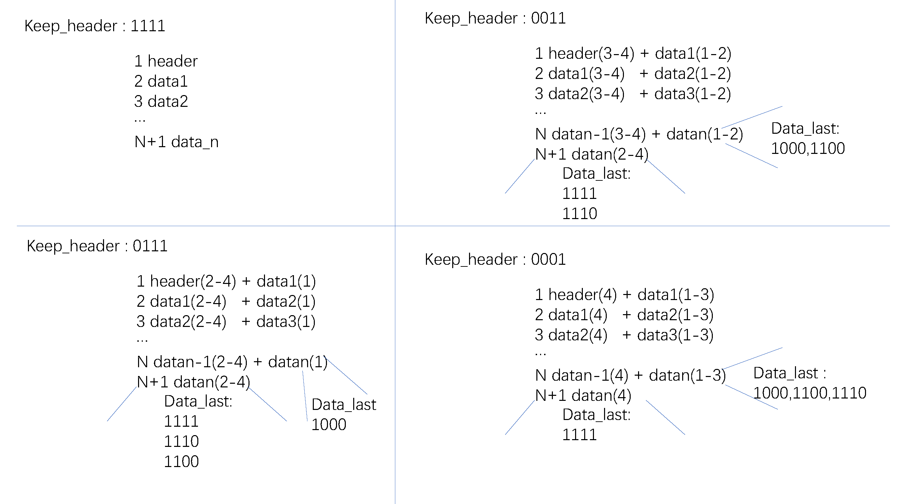

# Streaming

对题意的分析：

输入分析：

1）data_in和header_in到达时间

 - header_in快于data_in

   实现：接收完header数据后，由其驱动data_in输入，data_in依次进来后进行数据插入

 - header_in与data_in同时到达

   实现：header/data_in缓存一拍后，下一个周期进行拼接，于此同时缓存下一个data_in数据时，下一个周期需要转换拼接的方式，也即当前数据与下一个数据拼接，需要一个转换信号。

 - header_in慢于data_in

   实现：data_in需要进行缓存，在未知header_in时钟周期到来上线时，需要一块RAM来存储data_in数据，当存满时header还没到达，需要反压输出。

2）传输方式：

- 接收多个header_in，接收多个data_in ?

  可以将多个header_in缓存到fifo中，数据插入时从fifo读取，fifo小于多少阈值/为空，往外继续读取header，可以让输入和输出时钟重叠，节省周期。

- 接收1个header_in后，接收多个data_in? 

输出情况分析：
1）当header_in keep输入1的个数+data_in最后一个数据keep输入1的个数小于keep的位宽时，输出长度与data_in的长度一致

2）当header_in keep输入1的个数+data_in最后一个数据keep输入1的个数大于keep的位宽时，输出长度比data_In的长度多1

输出长度是可变的

综上分析：

这个题假设的场景：
header_in快于data_in，接收1个header信号后，操作完一次数据插入，再接收下一个（尽管会浪费一些时钟周期）

数据插入逻辑：当header数据准备好后，data_in 数据握手成功后，依次插入，插入好的数据放在buffer1，剩余的放在buffer2，待下一次数据到来，则用buffer2的数据进行拼接，更新buffer2的数据，依次类推

数据输出逻辑：当输出的长度需要额外多1拍，则对last_in延迟一拍last_in_delay1，作为标记位，根据标记位，将buffer2的数据移动到buffer1，last_out的信号再对last_in_delay1延迟一拍。此外，keep_out在last_in信号到来之际判断是否需要缓存下一个keep数据，若需要缓存，则在last_in_delay1有效时，将缓存的数据送到keep_out

